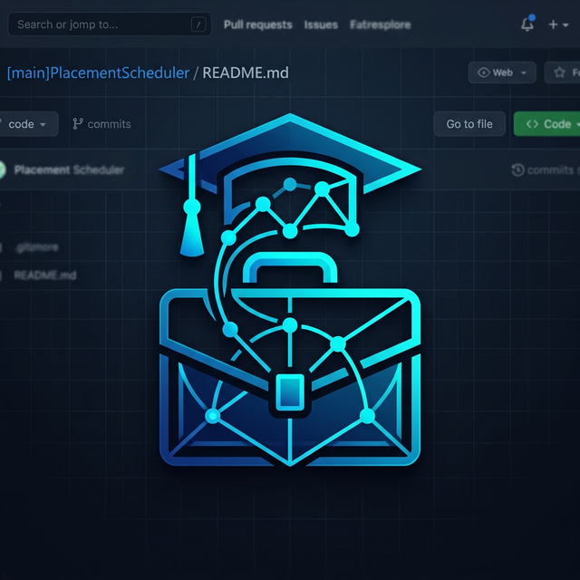

# 🎓 Placement Scheduler

<div align="center">
  
</div>

<p align="center">
  <strong>A high-performance Recruitment Management System powered by advanced Data Structures and Algorithms.</strong>
</p>

<p align="center">
  
  
  
  
</p>

---

## 🚀 Overview

The **Placement Scheduler** is a full-stack solution designed to streamline college placement processes. It bridges the gap between students and recruitment opportunities using a **hybrid architecture** that combines the rapid development of Python Flask with the computational efficiency of C++ algorithms.

### 🌟 Key Objectives
- **Efficiency**: Minimize time spent on data sorting and searching using O(n log n) and O(log n) algorithms.
- **Priority**: Ensure students see the most lucrative opportunities first.
- **Organization**: Centralized management for administrators and personalized dashboards for students.

---

## 🧠 Algorithmic Core (DAA Implementation)

This project serves as a practical implementation of fundamental **Design and Analysis of Algorithms (DAA)** concepts:

### 1️⃣ Merge Sort (Divide & Conquer)
- **Application**: Sorting students by Roll Number and CGPA.
- **Complexity**: **O(n log n)** (Stable sorting).
- **Why?**: Ensures a predictable, organized view of student data regardless of input order.

### 2️⃣ Binary Search (Efficient Search)
- **Application**: Instant student lookup by Roll Number.
- **Complexity**: **O(log n)**.
- **Prerequisite**: Automatic pre-sorting via Merge Sort.

### 3️⃣ Priority Queue / Max Heap
- **Application**: Company listing prioritized by stipend amount.
- **Complexity**: **O(log n)** for insertion/extraction.
- **Result**: Students are naturally guided towards high-value placements first.

### 4️⃣ Greedy Choice Property
- **Application**: Early-bird interview slot assignment.
- **Logic**: Always prioritizing the earliest available resource to optimize schedule density.

---

## 🛠️ Features & Roles

### 👨‍💼 Administrator Portal
- **Company Management**: Upload upcoming companies with detailed requirements and stipends.
- **Resource Hub**: Upload and manage practice worksheets for student preparation.
- **Interview Scheduling**: Create mock interview slots (3 students/teacher capacity).
- **Student Analytics**: Search and filter students, view academic performance (CGPA sorting).

### 🎓 Student Portal
- **Application Engine**: One-click application to listed companies.
- **Interview Booking**: Interactive slot booking with a "First Available" greedy priority.
- **Learning Center**: Access and complete prep worksheets.
- **Profile Management**: Maintain academic records and track application history.

---

## 📁 Project Structure

```bash
DAA-PBL/
├── assets/                # Design assets and logos
├── backend/               # Python Flask Server & C++ Modules
│   ├── cpp_source/        # DAA Algorithm Implementations (C++)
│   ├── cpp_executables/   # Compiled Binary Modules
│   ├── data/              # JSON Data Persistence
│   └── app.py             # Flask API Layer
├── frontend/              # Web Interface
│   ├── index.html         # Core UI
│   ├── styles.css         # Custom Visual System
│   └── scripts.js         # Frontend Logic & API Fetch
└── README.md
```

---

## ⚙️ Quick Setup

### 1. Requirements
- Python 3.x
- G++ Compiler (MinGW for Windows)

### 2. Installation
```bash
# Clone the repository
git clone https://github.com/purvanshjoshi/Placement-Scheduler-DAA-PBL.git
cd Placement-Scheduler-DAA-PBL

# Install dependencies
pip install flask flask-cors
```

### 3. Compilation & Run
```bash
# Compile C++ modules
cd backend/cpp_source
./compile.bat

# Start Backend Server
cd ..
python app.py
```

---

## 🎨 Visual Identity
The project utilizes a modern **Glassmorphism** UI with a custom-designed professional logo, ensuring a premium user experience for both students and admins.

---

<p align="center">
  Developed with ❤️ for the <strong>DAA-PBL Coursework</strong>.
</p>
